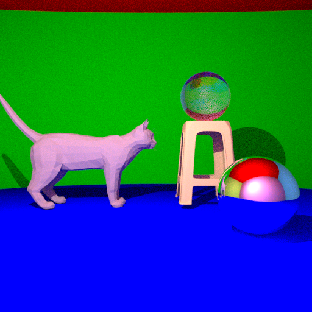
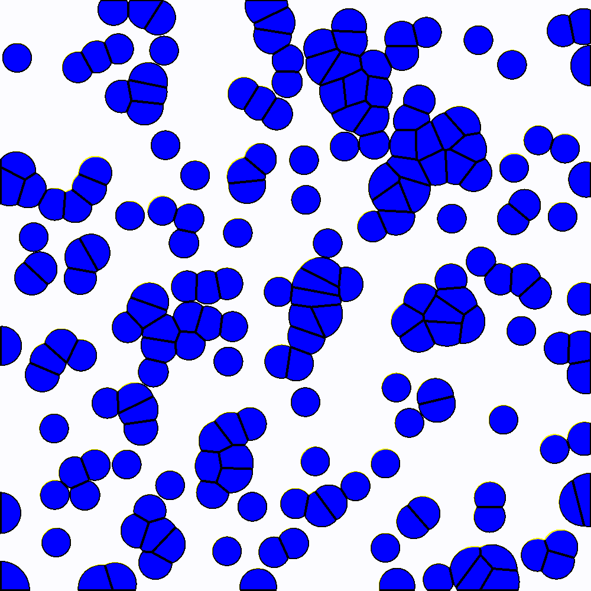

# CSE306 - Computer Graphics

Author: Jasmine Watissee (jasmine.watissee@polytechnique.edu)

## Download

```sh
$ git clone https://github.com/jasminewatissee/CSE306-Computer-Graphics.git
```

## Raytracer



### Features
- Spheres with diffuse surfaces
- Mirror surfaces (reflection)
- Transparent surfaces (refraction)
- Hollow spheres
- An attempt at soft shadows (in soft_shadow.cpp)
- Indirect light
- Fresnel effect
- Basic Parallelization
- Antialiasing
- Triangle Meshes with .obj file (objects different than spheres: cat and stool)
- Bounding Box and BVH (Bounding Volume Hierarchies)

### Usage

```sh
$ cd RayTracer/
$ make raytracer
$ ./raytracer
```

You can modify the content of the scene in the function main() 

To run the soft_shadow script even though it doesn't give the expected result, you can do:

```sh
$ cd RayTracer/
$ make soft_shadow
$ ./soft_shadow
```

## Color Matching


### Usage

```sh
$ cd Lab5\ -\ Color\ Matching
$ make
$ ./main
```

## Fluid Simulator


### Features
- Voronoï Diagram
- Sutherland-Hodgman polygon clipping
- Optimisation using LBFGS
- Disks instead of cells
- Fluid Simulator

### Usage

```sh
$ cd Geometry/
$ make
$ ./geo <OPT>
```

With \<OPT> being one of:
- 0 for a Voronoï Diagram
- 1 for an Optimized Voronoï Diagram
- 2 for an Optimized Diagram with circles
- 3 for a fluid simulation

## Tutte embedding

### Usage

```sh
$ cd Lab9\ -\ Tutte
$ make
$ ./main
```
